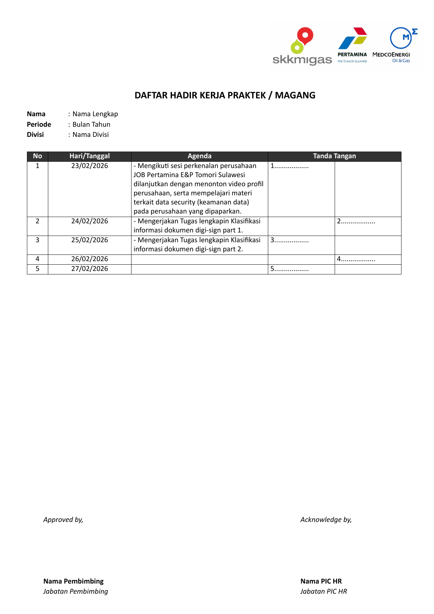

# Logbook Magang Template

<p align="center">
  Minimal internship logbook template in LaTeX (Bahasa Indonesia)
</p>

<div align="center">
  <a href="https://github.com/Mirza42069/Logbook-Magang-JOBMedcoPertamina/actions/workflows/compile-pdfs.yml">
    
  </a>
  <a href="examples/logbook.pdf">
    
  </a>
</div>

<br />

## Quick Start

1. Download [Logbook_Template_Overleaf.zip](Logbook_Template_Overleaf.zip)
2. Go to [Overleaf.com](https://www.overleaf.com) and select `New Project` > `Upload Project`
3. Upload `Logbook_Template_Overleaf.zip`
4. Set compiler to **XeLaTeX** (`Menu` > `Compiler` > `XeLaTeX`) and click **Recompile**

This template uses `fontspec` with Calibri, so **XeLaTeX is required** for local and Overleaf compilation.


## Preview

You can see [PDF](examples/logbook.pdf)

| Page 1 |
|:---:|
| [](examples/logbook.pdf) |

## Local Compile

```bash
cd examples
xelatex logbook.tex
```
