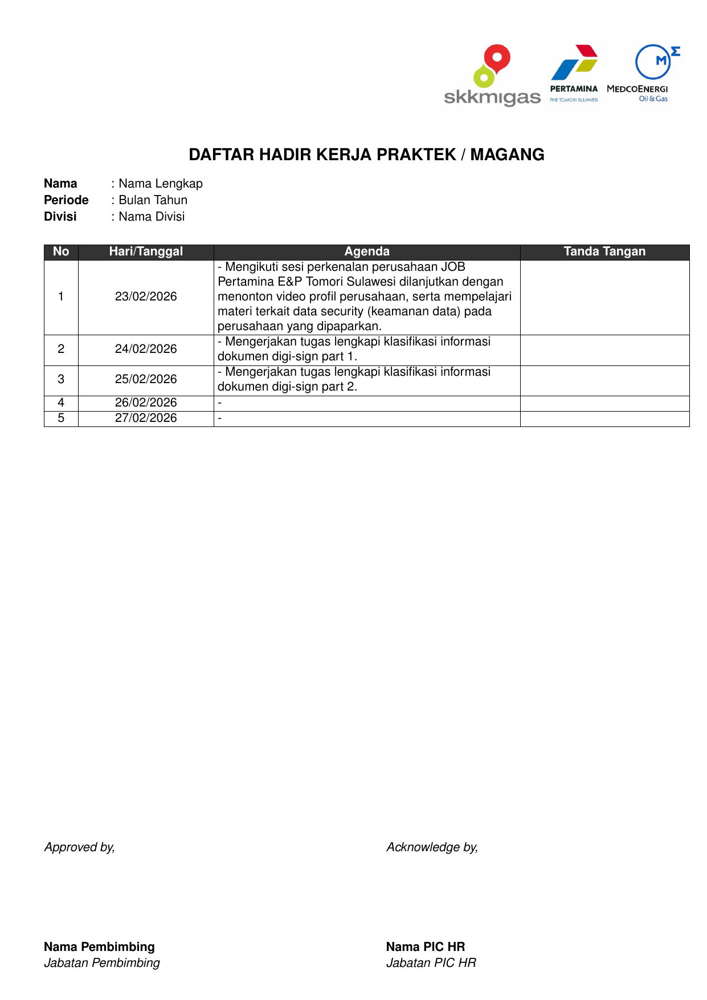

# Logbook Magang Template

<p align="center">
  Minimal internship logbook template in LaTeX (Bahasa Indonesia)
</p>

<div align="center">
  <a href="https://github.com/Mirza42069/Logbook-Magang-JOBMedcoPertamina/actions/workflows/compile-pdfs.yml">
    
  </a>
  <a href="overleaf/logbook.pdf">
    
  </a>
</div>

<br />

## Quick Start

1. Download [Logbook_Template_Overleaf.zip](Logbook_Template_Overleaf.zip)
2. Go to [Overleaf.com](https://www.overleaf.com) and select `New Project` > `Upload Project`
3. Upload `Logbook_Template_Overleaf.zip`
4. Click **Recompile** (works with Overleaf default compiler)

For best visual match with the original Excel (Calibri), use **XeLaTeX** or **LuaLaTeX**.


## Preview

You can see [PDF](overleaf/logbook.pdf)

| Page 1 |
|:---:|
| [](overleaf/logbook.pdf) |

## Local Compile (`local/logbook2.tex`)

For Windows local builds, use **MiKTeX** + **Strawberry Perl**.

1. Install MiKTeX (TeX distribution)
2. Install Strawberry Perl (required by `latexmk`)
3. Open terminal in this repo and run:

```bash
cd local
latexmk -xelatex -interaction=nonstopmode -halt-on-error logbook2.tex
```

If `latexmk` is unavailable, use two XeLaTeX passes:

```bash
cd local
xelatex logbook2.tex
xelatex logbook2.tex
```
